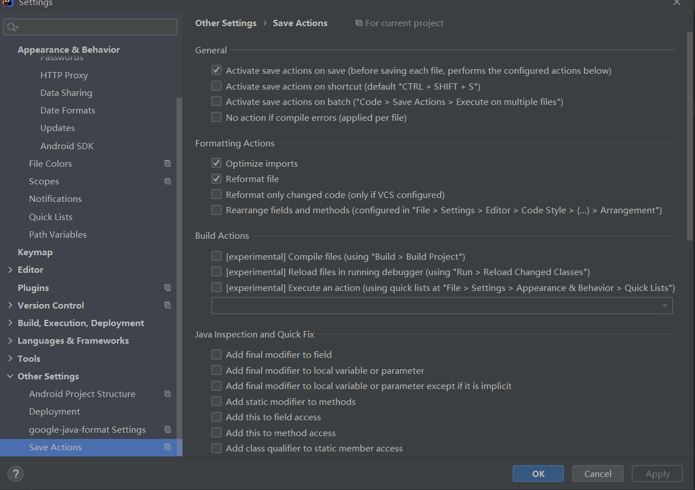

# idea

## idea管理java程序的结构

- project（项目、工程）
- module（模块）
- package（包）
- class（类）

## 新建java包名要倒序

Java包名的倒序是为了确保包名的唯一性和组织结构的层次性。

Java的包（Package）是一种用于组织类和接口的方式，它将相关的类和接口放在一起，并提供命名空间来避免命名冲突。包名的倒序命名规则是为了确保包名的全局唯一性。通过将域名或公司的唯一标识作为包名的起始部分，可以避免不同组织或开发者使用相同的包名。这种倒序命名规则也有助于将包名反映为域名的层次结构，以提供更好的组织结构和可读性。

例如，假设有一个名为 "com.example.myproject" 的包名，它包含了一个名为 "MyClass" 的类。这个包名表明该项目属于 "example.com" 这个域名下的 "myproject" 项目，而 "MyClass" 类是该项目的一部分。这种命名规则使得不同组织或开发者的包名可以在整个 Java 生态系统中保持唯一性，减少了命名冲突的可能性。

总之，Java包名的倒序命名规则旨在确保包名的唯一性和组织结构的层次性，并提供更好的命名约定和可读性。

## 运行项目

#### 默认快捷键

```sh
Alt+Shift+F10
```

#### 自定义快捷键

File>Settings>Keymap>搜索run>为run添加快捷键

## 语法补全-main方法

```sh
main
```

## 语法补全-System.out.println();

```sh
sout 
```

## 语法补全-数组for循环

```sh
fori
```

## 安装插件

File>Settings>Plugins>搜索插件名

如果加载不出来插件列表，检查Appearance&Behavior>System Settings>HTTP Proxy中是否开启了proxy，如果有则关闭proxy

注意！安装完插件不能生效的话，可能需要重启idea

### google-java-format 

google格式化风格插件，需要勾选来启用


### Save Actions

保存时自动格式化插件，如下勾选，`Reformat file`表示格式化文件



### maven-helper

右击显示运行maven列表

### idea保存时自动格式化和打包

> https://blog.csdn.net/jh1141233305/article/details/121171142

## 搜索所有文件指定内容

File-Settings-Keymap-Find in Files

## The Tomcat connector configured to listen on port 8080 failed to start

```sh
1. 调出命令终端
win+r 并且输入cmd
 
2. 查看某个端口(8080)的被占用情况
netstat -ano |findstr 8080
 
3. 根据进程号(24068)关闭进程即可
taskkill -PID 24068 -F 
```

## idea选中文件时左侧菜单自动定位到文件所在位置

点击左侧目录栏右上角齿轮设置，勾选上`Always Select Opened File  `

## Idea Maven错误：was cached in the local repository, resolution will not be reattempted until the update

> https://blog.csdn.net/wqc19920906/article/details/119057159


