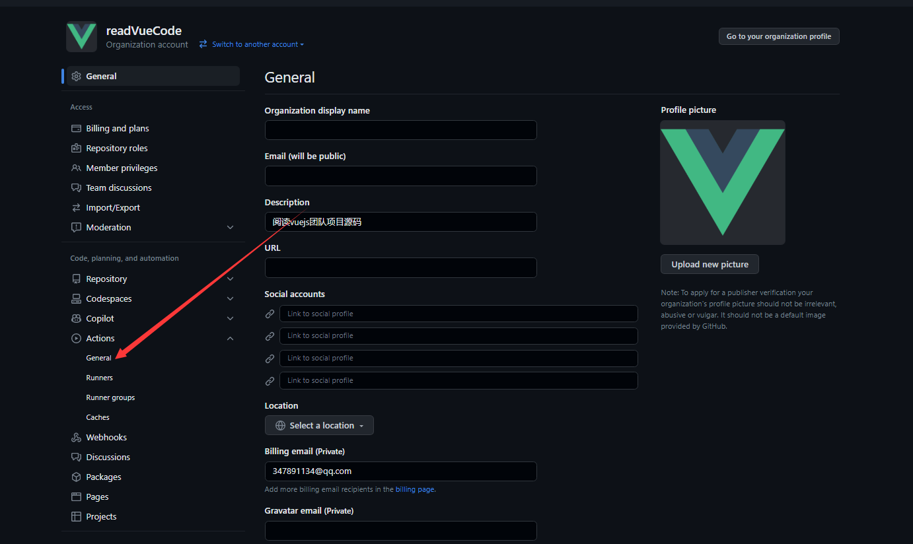

# github

## 启用clash后使用git命令出现Failed to connect to github.com port 443: Connection refused

重新设置代理，将代理端口号，设置上去。 clash默认代理端口号 7890 设置如下：

```sh
# clash for windows设置代理，访问github
git config --global http.proxy http://127.0.0.1:7890
git config --global https.proxy http://127.0.0.1:7890

# 取消代理
git config --global --unset http.proxy
git config --global --unset https.proxy

# 查看代理
git config --global http.proxy
git config --global https.proxy
```

## pull-request

> 主要用于为开源项目做出自己的贡献，以下为相应步骤

1. 点击开源项目仓库右上方fork，会在自己仓库生成fork版本的项目

2. git clone fork后的项目

3. 开发项目

4. push项目代码至自己仓库

5. 新建pull request请求

6. 被请求项目的管理员测试审核通过，进行合并

## 网页端打开项目

github项目页面按下`.`键，即可使用网页版vscode打开当前项目

## gitpod

> 云开发与运行项目的平台

在github项目地址前加上`gitpod.io/#/`，例如：

```sh
https://gitpod.io/#/github.com/antfu/unplugin-auto-import
```

从而会跳转至gitpod平台，会自动下载项目依赖，从而在线运行项目

```sh
https://antfu-unpluginautoimpo-v4a7st4kzi7.ws-us45.gitpod.io/
```

## hosts

[github](https://so.csdn.net/so/search?q=github&spm=1001.2101.3001.7020)的ip地址经常变，可以在[这里](https://www.ipaddress.com/)查询

打开C:\Windows\System32\drivers\etc\hosts，设置github的host

## raw.githubusercontent.com不能访问

打开C:\Windows\System32\drivers\etc\hosts

```sh
199.232.28.133  raw.githubusercontent.com
```

## .github

### CODEOWNERS

在做日常迭代交付时提交的 PR，指定组内成员进行代码评审，当代码变更涉及到某文件或目录 A 时，大多数情况下会指派固定的人员 B 进行代码评审。我们就可以称为 B 是 组件 A 的 CodeOwner。简单来说，Codeowner 用来定义谁负责仓库中的特定文件或目录。

想要使用 CodeOwner 功能，需要在仓库中指定的位置创建一个名为`CODEOWNERS`文件，它们仅适用于当前分支，指定的位置为：

- 在仓库的根目录中
- 在`.gitee/`目录中
- 在`docs/`目录中

## workflow 文件

`GitHub Actions` 的配置文件叫做 **workflow**文件，存放在代码仓库的`.github/workflows/`目录下。比如写一个`first.yaml`文件，存储的目录就是`.github/workflows/first.yaml`

### on. .

指定触发事件时，可以限定分支或标签。

```yaml
on:
  push:
    branches:
      - master
```

上面代码指定，`push`事件触发 **workflow**，指定分支是master分支

### jobs..name

**workflow** 文件的主体是`jobs`字段，表示要执行的一项或多项任务。

`jobs`字段里面，需要写出每一项任务的`job_id`，具体名称自定义。`job_id`里面的`name`字段是任务的说明。

```yaml
jobs:
  my_first_job:
    name: My first job
  my_second_job:
    name: My second job
```

### jobs..runs-on

`runs-on`字段指定运行所需要的虚拟机环境。它是必填字段。目前可用的虚拟机如下。

```yaml
ubuntu-latest，ubuntu-18.04或ubuntu-16.04
windows-latest，windows-2019或windows-2016
macOS-latest或macOS-10.14
```

下面代码指定虚拟机环境为ubuntu-18.04。

```yaml
runs-on: ubuntu-18.04
```

## 设置workflow权限

### 组织

允许组织仓库github workflow有读写权限，运行部署github pages需要这个权限





## github api调用

### 第一步，获取授权code

client_id是OAuthApp的id，scope控制授权，public_repo表示公共仓库的读写权力

```js
const githubLogin = () => {
  location.href = `https://github.com/login/oauth/authorize?client_id=${client_id}&scope=public_repo`;
};
```

授权完会在跳回设置的页面

### 创建问题

请求头里需要添加token

```js
https://api.github.com/repos/zqy233/formatAndSave/issues
```

title参数即问题名称，必须传

```js
{
  "title": "Found a bug"
}
```
