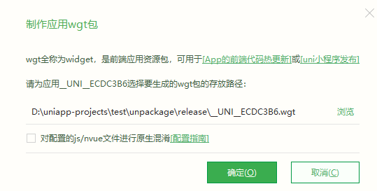

# app检查更新与升级

学习自以下内容

> 升级中心 uni-upgrade-center - App https://ext.dcloud.net.cn/plugin?id=4542
>
> uni-upgrade-center官方文档https://uniapp.dcloud.net.cn/uniCloud/upgrade-center.html#uni-upgrade-center-app
>
> h5+ api https://www.html5plus.org/doc/zh_cn/runtime.html#plus.runtime.appid
>
> App资源在线升级更新 https://ask.dcloud.net.cn/article/182
>
> uni-app使用plus注意事项 https://uniapp.dcloud.net.cn/tutorial/use-html5plus.html
>
> 关于在线升级（WGT）的几个疑问 https://ask.dcloud.net.cn/question/10369

##  `uni-upgrade-center`源码阅读

十分推荐阅读`uni-upgrade-center`源码

通过一步步阅读`uni-upgrade-center`源码，基本能完全学会如何写app检查更新与升级的代码

源码前端功能实现主要分为三个文件，依次阅读

1. `utils/call-check-version.js`
2. `utils/call-check-version.js`
3. `pages/upgrade-popup.vue`

## `utils/call-check-version.js`

代码很简单，通过h5+ api获取应用信息，把应用信息传递给uniCloud云函数

同理，如果不使用云函数，传给java等后端服务的话，替换云函数部分代码就可以了

```js
export default function () {
  // #ifdef APP-PLUS
  return new Promise((resolve, reject) => {
    // 根据当前应用的appid，获取appid对应的应用信息
    plus.runtime.getProperty(plus.runtime.appid, function (widgetInfo) {
      const data = {
        action: 'checkVersion',
        appid: plus.runtime.appid,
        appVersion: plus.runtime.version,
        wgtVersion: widgetInfo.version
      }
      console.log("data: ", data);
      // 如果传给java等后端服务，改下方代码
      uniCloud.callFunction({
        name: 'uni-upgrade-center',
        data,
        success: (e) => {
          console.log("e: ", e);
          resolve(e)
        },
        fail: (error) => {
          reject(error)
        }
      })
    })
  })
  // #endif
  // #ifndef APP-PLUS
  return new Promise((resolve, reject) => {
    reject({
      message: '请在App中使用'
    })
  })
  // #endif
}
```

## plus.runtime.appid

当前应用的APPID

String 类型 只读属性

注意，如果是在HBuilder真机运行获取的是固定值"HBuilder"，需要提交App云端打包后运行才能获取真实的APPID值

## plus.runtime.getProperty

获取指定APPID对应的应用信息

### 参数：

- appid: ( String ) 必选  应用的Appid
- getPropertyCB: ( [GetPropertyCallBack](https://www.html5plus.org/doc/zh_cn/runtime.html#plus.runtime.GetPropertyCallBack) ) 必选 获得应用信息成功回调函数

### 示例：

```js
// 获取应用信息
function getAppInfo() {
	plus.runtime.getProperty( plus.runtime.appid, function ( wgtinfo ) {
		//appid属性
		var wgtStr = "appid:"+wgtinfo.appid;
		//version属性
		wgtStr += "<br/>version:"+wgtinfo.version;
		//name属性
		wgtStr += "<br/>name:"+wgtinfo.name;
		//description属性
		wgtStr += "<br/>description:"+wgtinfo.description;
		//author属性
		wgtStr += "<br/>author:"+wgtinfo.author;
		//email属性
		wgtStr += "<br/>email:"+wgtinfo.email;
		//features 属性
		wgtStr += "<br/>features:"+wgtinfo.features;
		console.log( wgtStr );
	} );
}
```

## `utils/call-check-version.js`

官方实现了两种方式，静默更新和提示更新

```js
import callCheckVersion from './call-check-version'

// 推荐在App.vue中使用
const PACKAGE_INFO_KEY = '__package_info__'

export default function() {
	// #ifdef APP-PLUS
	return new Promise((resolve, reject) => {
		callCheckVersion().then(async (e) => {
			if (!e.result) return;
			const {
				code,
				message,
				is_silently, // 是否静默更新
				url, // 安装包下载地址
				platform, // 安装包平台
				type // 安装包类型
			} = e.result;

			// 此处逻辑仅为实例，可自行编写
			if (code > 0) {
				// 腾讯云和阿里云下载链接不同，需要处理一下，阿里云会原样返回
				const {
					fileList
				} = await uniCloud.getTempFileURL({
					fileList: [url]
				});
				if (fileList[0].tempFileURL)
					e.result.url = fileList[0].tempFileURL;

				resolve(e)

				// 静默更新，只有wgt有
				if (is_silently) {
					uni.downloadFile({
						url: e.result.url,
						success: res => {
							if (res.statusCode == 200) {
								// 下载好直接安装，下次启动生效
								plus.runtime.install(res.tempFilePath, {
									force: false
								});
							}
						}
					});
					return;
				}

				/**
				 * 提示升级一
				 * 使用 uni.showModal
				 */
				// return updateUseModal(e.result)

				/**
				 * 提示升级二
				 * 官方适配的升级弹窗，可自行替换资源适配UI风格
				 */
				uni.setStorageSync(PACKAGE_INFO_KEY, e.result)
				uni.navigateTo({
					url: `/uni_modules/uni-upgrade-center-app/pages/upgrade-popup?local_storage_key=${PACKAGE_INFO_KEY}`,
					fail: (err) => {
						console.error('更新弹框跳转失败', err)
						uni.removeStorageSync(PACKAGE_INFO_KEY)
					}
				})
				
				return
			} else if (code < 0) {
				// TODO 云函数报错处理
				console.error(message)
				return reject(e)
			}
			return resolve(e)
		}).catch(err => {
			// TODO 云函数报错处理
			console.error(err.message)
			reject(err)
		})
	});
	// #endif
}

/**
 * 使用 uni.showModal 升级
 */
function updateUseModal(packageInfo) {
	const {
		title, // 标题
		contents, // 升级内容
		is_mandatory, // 是否强制更新
		url, // 安装包下载地址
		platform, // 安装包平台
		type // 安装包类型
	} = packageInfo;

	let isWGT = type === 'wgt'
	let isiOS = !isWGT ? platform.includes('iOS') : false;
	let confirmText = isiOS ? '立即跳转更新' : '立即下载更新'

	return uni.showModal({
		title,
		content: contents,
		showCancel: !is_mandatory,
		confirmText,
		success: res => {
			if (res.cancel) return;

			// 安装包下载
			if (isiOS) {
				plus.runtime.openURL(url);
				return;
			}

			uni.showToast({
				title: '后台下载中……',
				duration: 1000
			});

			// wgt 和 安卓下载更新
			downloadTask = uni.downloadFile({
				url,
				success: res => {
					if (res.statusCode !== 200) {
						console.error('下载安装包失败', err);
						return;
					}
					// 下载好直接安装，下次启动生效
					plus.runtime.install(res.tempFilePath, {
						force: false
					}, () => {
						if (is_mandatory) {
							//更新完重启app
							plus.runtime.restart();
							return;
						}
						uni.showModal({
							title: '安装成功是否重启？',
							success: res => {
								if (res.confirm) {
									//更新完重启app
									plus.runtime.restart();
								}
							}
						});
					}, err => {
						uni.showModal({
							title: '更新失败',
							content: err
								.message,
							showCancel: false
						});
					});
				}
			});
		}
	});
}
```

## 静默更新

可以看出静默更新分为三步：

1. 后端提供一个下载更新包的url
2. 前端`uni.downloadFile`该url地址
3. 下载好后前端调用`plus.runtime.install`安装更新包

```js
// 静默更新，只有wgt有
			if (is_silently) {
				uni.downloadFile({
					url: e.result.url,
					success: res => {
						if (res.statusCode == 200) {
							// 下载好直接安装，下次启动生效
							plus.runtime.install(res.tempFilePath, {
								force: false
							});
						}
					}
				});
				return;
			}
```

## 强制更新

首先，我们需要知道的是，`plus.runtime.install`成功后就已经安装完更新包了，用户下次打开app就会是最新版的app，这里强制更新的意思是是否立刻重启app，强制用户立刻使用最新版app

`plus.runtime.install`后有三种应用场景，这里官方写的很好，三种场景都处理了：

1. 不征求客户意见，直接重启app，强制用户立刻使用最新版
2. 征求客户意见，如果重启，用户使用最新版，如果不重启，等用户下次打开app显示最新版
3. 不重启，等用户下次打开app显示最新版

```js
			    // 安装下载的安装包，下次启动生效
					plus.runtime.install(res.tempFilePath, {
						force: false
					}, () => {
            // is_mandatory是后端返回的控制是否强制更新的变量
            // 强制更新就是强制重启app，否则就是用户下次打开app才会更新
            // 强制更新体验不好，还是下次打开更新会好很多
						if (is_mandatory) {
							// 更新完重启app
							plus.runtime.restart();
							return;
						}
						uni.showModal({
							title: '安装成功是否重启？',
							success: res => {
								if (res.confirm) {
									// 更新完重启app
									plus.runtime.restart();
								}
							}
						});
					}, err => {
						uni.showModal({
							title: '更新失败',
							content: err
								.message,
							showCancel: false
						});
					});
```

## 跳转应用商店

1. 后端返回安装包平台和安装包类型
2. 安装包类型是否是`wgt`，如果不是，判断安装包平台是否包含`iOS`，调用第三方程序打开url安装`iOS`更新包，`iOS`是跳转更新，其他是下载更新
3. ios需要上架、通过市场安装，所以需要第三方程序打开url

`plus.runtime.openURL`表示调用第三方程序打开url进行安装，即跳转应用商店功能

```js
function updateUseModal(packageInfo) {
	const {
		title, // 标题
		contents, // 升级内容
		is_mandatory, // 是否强制更新
		url, // 安装包下载地址
		platform, // 安装包平台
		type // 安装包类型
	} = packageInfo;

	let isWGT = type === 'wgt'
	let isiOS = !isWGT ? platform.includes('iOS') : false;
	let confirmText = isiOS ? '立即跳转更新' : '立即下载更新'

	return uni.showModal({
		title,
		content: contents,
		showCancel: !is_mandatory,
		confirmText,
		success: res => {
			if (res.cancel) return;

			// 安装包下载
			if (isiOS) {
				plus.runtime.openURL(url);
				return;
			}
      ...
		}
	});
}
```

## 用户取消下载

> https://uniapp.dcloud.net.cn/api/request/network-file.html#downloadfile

```js
var downloadTask = uni.downloadFile({
	url: 'https://www.example.com/file/test', //仅为示例，并非真实接口地址。
	complete: ()=> {}
});
downloadTask.abort();
```

## 如何打包wgt资源包

一、更改项目`manifest.json`中的应用版本名称与应用版本号


二、HBuilderX>发行>原生App-制作应用wgt包>确定





三、开发测试的时候，记得再改回原先的应用版本名称与应用版本号，不然版本跟线上的相同，安装更新包的时候就会出现`WGT安装包中manifest.json文件的version版本不匹配`，本地测试不了更新效果

### 查看wgt文件小技巧

wgt包生成后会是`.wgt`后缀名，更改其后缀名为`.zip`，再解压，就可以查看wgt文件内容了，主要是可以查看`manifest.json`

## 报错解决：WGT安装包中manifest.json文件的version版本不匹配

`manifest.json`中的版本大于等于了线上的版本，自行排查即可

## 通过uni-admin上传wgt资源包

> https://ext.dcloud.net.cn/plugin?id=4470


## uni-admin报错解决：超级管理员已存在

https://ask.dcloud.net.cn/question/153641

是因为admin账户是旧的，跟appid对不上，删除旧的admin账户，重新创建


